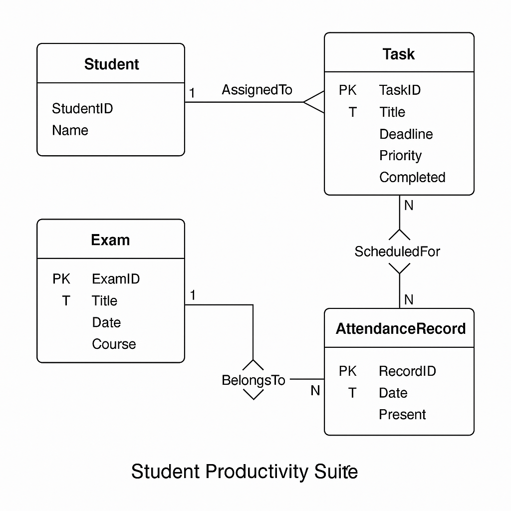

# 🎓 Student Productivity Suite

A simple C++ console-based application to manage students’ tasks, exams, and attendance. This project demonstrates **real-world OOP design** and uses **DSA techniques** like binary search and priority queues for fast and efficient operations.

---

## ✨ Features
- 📋 Add, view, and search tasks (with priority & deadlines)
- 📅 Schedule and manage upcoming exams
- ✅ Mark and track student attendance
- 🔍 Binary Search for quick task lookup by title
- ⏫ View Top-K priority tasks per student
- ⚡ Notifications dashboard for pending tasks & exams
- 👥 Manage multiple students with fast ID-based lookup

---

## 🧠 Core Concepts Used
- **Object-Oriented Programming (OOP)**
  - Encapsulation (private members, public APIs)
  - Abstraction (high-level interfaces for students/tasks)
  - Aggregation (`Student has Tasks, Exams, Attendance`)
  - Operator Overloading (`operator<` for sorting)
- **Data Structures & Algorithms (DSA)**
  - Binary Search for finding tasks
  - Priority Queue (Top-K tasks)
  - Unordered Map for O(1) student lookups
- **Modern C++17 Features**
  - Initializer Lists
  - Lambda Functions
  - Range-based for loops

---

## 🛠️ Installation & Running

📦 Clone the repository:

git clone https://github.com/your-username/student-productivity-suite.git
cd student-productivity-suite
⚡ Compile:

bash
Copy
Edit
g++ -std=c++17 productivity.cpp -o student-suite
🚀 Run:

bash
Copy
Edit
./student-suite
--------

📐 ER Diagram
This diagram shows relationships between Students, Tasks, Exams, and Attendance.

 

---

📦 File Structure
bash
Copy
Edit
📁 student-productivity-suite
├── productivity.cpp   # All classes and logic
├── README.md          # Project information and usage
├── er_diagram.png     # Entity-Relationship Diagram
🚀 Example CLI
markdown
Copy
Edit
===== Student Productivity Suite =====
1. Add Student
2. Mark Attendance
3. View Attendance Report
4. Add Assignment (Task)
5. View Pending Assignments
6. Schedule Exam
7. View Upcoming Exams
8. Notifications Dashboard
9. Exit
📋 TODO
Add file-based persistence (save/load student data)

Support editing and deleting tasks/exams

Build a GUI version in future

🙋‍♀️ Author
Astha Sharma
